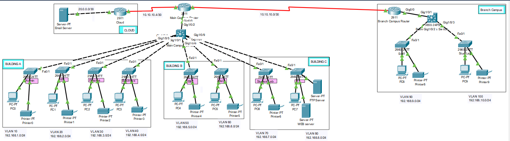

# enterprise-campus-network-cisco
**Overview**

Designed and simulated a scalable multi-campus university network using Cisco Packet Tracer. The project models an enterprise network consisting of multiple academic departments, a branch campus, and centralized network services while following a hierarchical network architecture.

**Network Topology :** 

**Implemented Features**
Multi-campus enterprise topology,
Hierarchical network design,
VLAN segmentation,
Inter-VLAN Routing,
RIP v2 Dynamic Routing,
DHCP,
Web Server,
FTP Server,
Email Server,
IP Addressing & Subnetting,
End-to-End Connectivity Testing.

**Planned Enhancements**
DNS Server,
NAT,
ACL-based Security,
Port Security,
SSH Remote Management.
